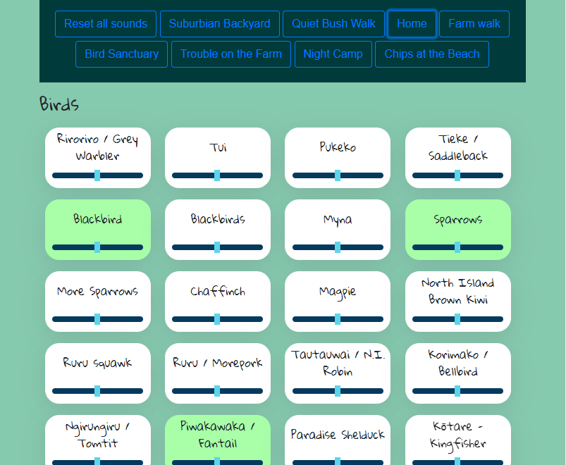

# birds-go-twurp
This is a website that will let you play New Zealand bird calls, and combine them to create a pleasant(hopefully) background sound. You can pick which bird calls sounds you want to listen too, or select a preset to start a selection of bird sounds at once.

Bird calls are mostly from inaturalist.nz; atributions and licenses for the sounds are shown at the bottom of the page.

Page interaction is handled using knockout.js and sounds are played by howler.js.

continuous integration with master/dev branch: https://birdsoundsci.netlify.app/

release branch is at: https://birdsounds.netlify.app/

To do:

* find some alpine birds? estuary?

